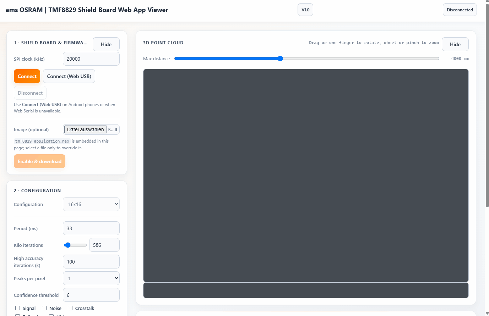
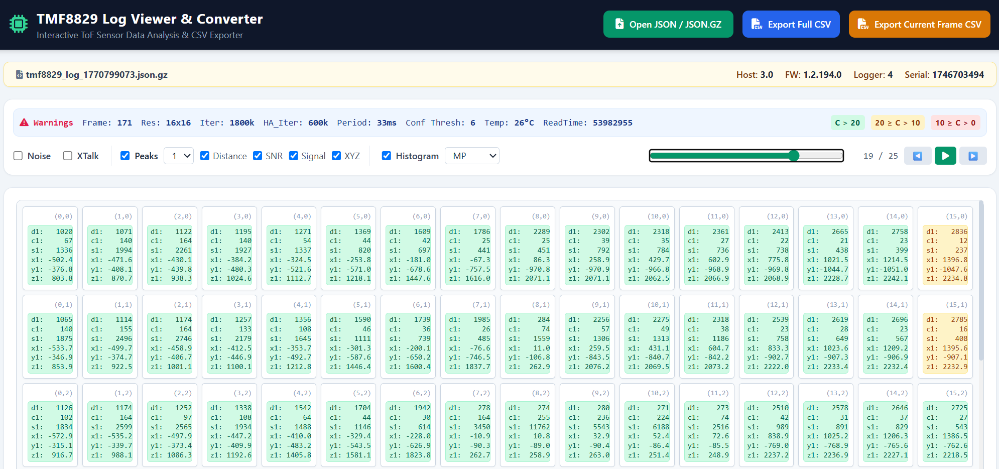

# ams-OSRAM web tools

- [TMF8829 Shield Board Web GUI](#tmf8829-shield-board-web-gui): 
  [tmf8829_web_gui.html](https://ams-osram.github.io/tmf8829/tmf8829_web_gui.html)

- [TMF8829 JSON Logfile viewer and CSV exporter](#tmf8829-json-logfile-viewer): 
  [tmf8829_json_viewer.html](https://ams-osram.github.io/tmf8829/ams_osram_tmf8829_json_viewer.html)

- [TMF8829 FoV Calcuation](#tmf8829-fov-calcuation): 
  [tmf8829_fov_calculator.html](https://ams-osram.github.io/tmf8829/ams_osram_tmf8829_fov_calculator.html)

## TMF8829 Shield Board Web GUI

A browser-only viewer for the TMF8829 on the 
[TMF8829_EVM_EB_SHIELD](https://ams-osram.com/products/boards-kits-accessories/kits/ams-tmf8829-evm-eb-shield-evaluation-kit) 
Evaluation kit. The page talks directly to the board over USB using the Web Serial API — 
no Python backendand no Arduino firmware needed. Connect the Shield EVM board via USB and open 

https://ams-osram.github.io/tmf8829/tmf8829_web_gui.html 

in a browser that supports WebSerial (Chrome, Edge or another Chromium based browser).

The same file runs on **Android** using WebUSB as well.

## TMF8829 JSON Logfile viewer and CSV exporter

The TMF8829 GUI and logger create .json/json.gz file - these file can be viewed easily and single frame/all frame exported
to CSV format, which can be used with e.g. excel, all inside a webbrower with
https://ams-osram.github.io/tmf8829/ams_osram_tmf8829_json_viewer.html

## TMF8829 FoV calcuation

You can run the tool with https://ams-osram.github.io/tmf8829/ams_osram_tmf8829_fov_calculator.html

